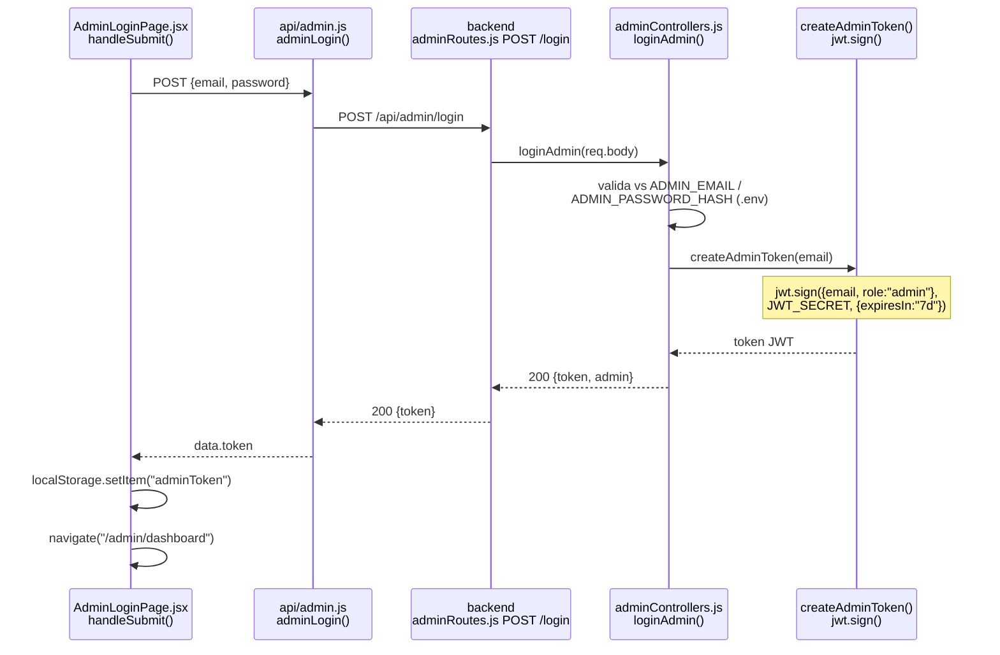
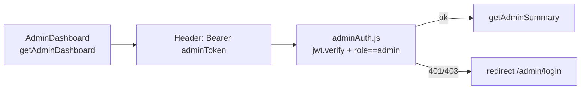

# Admin Login Flow — Dónde se genera el token

> El frontend **no genera** el token. Solo lo envía, lo recibe y lo guarda.
> El token se genera en el backend con `jwt.sign`.

## 1. Diagrama de secuencia (login)

## 2. Uso posterior del token (dashboard)

## 3. Referencias al código

| Paso | Archivo | Qué hace |
|------|---------|----------|
| 1. Submit form | `frontend/src/admin/AdminLoginPage.jsx:22` | `adminLogin(form)` |
| 2. POST | `frontend/src/api/admin.js:64` | `POST /api/admin/login` |
| 3. Guardado auto | `frontend/src/api/admin.js:38-41` | interceptor guarda `data.token` en `localStorage` |
| 4. Ruta | `backend/routes/adminRoutes.js:7` | `router.post("/login", loginAdmin)` |
| 5. Validación | `backend/controllers/adminControllers.js:166` | compara vs `ADMIN_EMAIL` + `ADMIN_PASSWORD` / `HASH` |
| 6. **Generación token** | `backend/controllers/adminControllers.js:14-16` | `jwt.sign({email, role:"admin"}, JWT_SECRET, {expiresIn:"7d"})` |
| 7. Respuesta | `backend/controllers/adminControllers.js:187-191` | `{ message, token, admin }` |
| 8. Guardado | `frontend/src/admin/AdminLoginPage.jsx:23-25` | `localStorage.setItem("adminToken", data.token)` |
| 9. Verificación | `backend/middleware/adminAuth.js:12` | `jwt.verify(token, JWT_SECRET)` + check `role === "admin"` |

## 4. Resumen en 1 línea

`Form → adminLogin() → loginAdmin → jwt.sign() → localStorage → adminAuth verifica`
